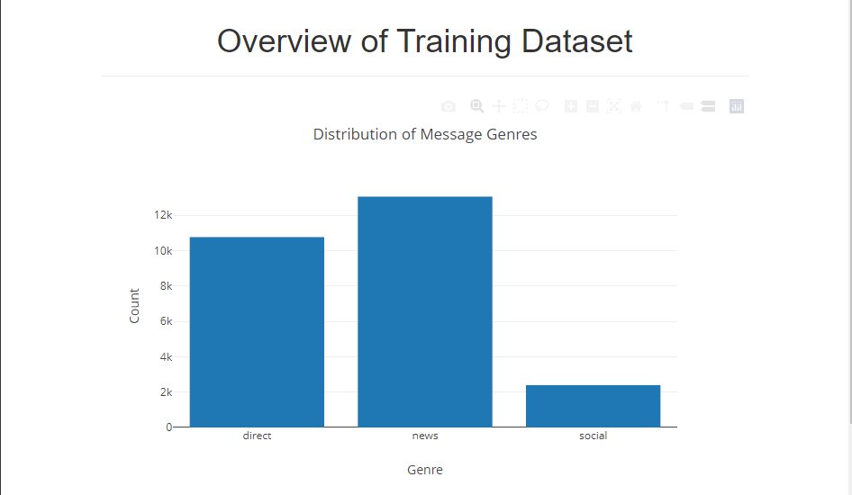

# Disaster Response Pipeline Project
In this project, we'll apply these skills to analyze disaster data from Appen (formally Figure 8) to build a model for an API that classifies disaster messages.

## File Structure
~~~~~~~
- app
| - template
| |- master.html  # main page of web app
| |- go.html  # classification result page of web app
|- run.py  # Flask file that runs app

- data
|- categories.csv  # data to process 
|- messages.csv  # data to process
|- process_data.py
|- DisasterResponse.db   # database to save clean data to

- models
|- train_classifier.py
|- classifier.pkl  # saved model 

- README.md
~~~~~~~

## Instructions:
1. Run the following commands in the project's root directory to set up your database and model.

    - To run ETL pipeline that cleans data and stores in database
        `python data/process_data.py data/messages.csv data/categories.csv data/DisasterResponse.db`
    - To run ML pipeline that trains classifier and saves
        `python models/train_classifier.py data/DisasterResponse.db models/classifier.pkl`

2. Go to `app` directory: `cd app`

3. Run your web app: `python run.py`

4. Click the `PREVIEW` button to open the homepage

## Summary Result
Catetories Distribution

Genres Distribution

Storm Prediction
